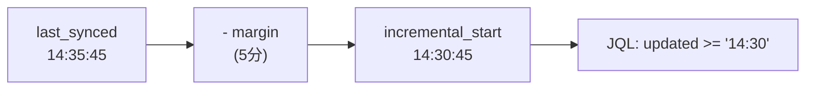

# データ同期（Sync）アーキテクチャ

このドキュメントでは、jira-db のデータ同期メカニズムについて詳しく説明します。

## 目次

1. [概要](#概要)
2. [全体フロー](#全体フロー)
3. [差分更新の仕組み](#差分更新の仕組み)
4. [チェックポイント機構](#チェックポイント機構)
5. [バッチ処理フロー](#バッチ処理フロー)
6. [中断からの復旧](#中断からの復旧)
7. [データ整合性の検証](#データ整合性の検証)

---

## 概要

jira-db の同期システムは以下の特徴を持ちます：

- **再開可能（Resumable）**: 中断しても最後のチェックポイントから再開
- **差分更新（Incremental）**: 前回同期以降に更新されたデータのみを取得
- **非同期処理（Async）**: Tokio ベースの完全非同期実装
- **バッチ処理**: 100件単位で処理し、各バッチ後にチェックポイントを保存

---

## 全体フロー


---

## 差分更新の仕組み

差分更新は、JQL（JIRA Query Language）の `updated` フィールドを使用して実現されます。

### JQLクエリの構成


### 詳細フロー


### なぜ `updated ASC` で並べ替えるのか


**ポイント**:
- `updated ASC` により、古い更新から順に処理
- 同期中に発生した新しい更新は、次回の同期で確実に取得される
- 決定論的な順序により、再開時の一貫性を保証

---

## チェックポイント機構

### チェックポイントの構造


### チェックポイントの保存タイミング


### settings.json の例

```json
{
  "projects": [
    {
      "key": "PROJ",
      "enabled": true,
      "sync_checkpoint": {
        "last_issue_updated_at": "2024-12-15T14:30:00Z",
        "last_issue_key": "PROJ-1234",
        "items_processed": 500,
        "total_items": 1500
      }
    }
  ]
}
```

---

## バッチ処理フロー

### 1バッチの詳細処理


### なぜ変更履歴を削除→再挿入するのか


---

## 中断からの復旧

### 中断シナリオ


### 再開時の重複回避


**重複回避の仕組み**:
1. `updated >= timestamp` で候補を取得
2. `last_issue_key` と一致する課題までスキップ
3. 同じ `updated` 時刻の課題も `key` で判定してスキップ
4. 未処理の課題から処理を再開

---

## データ整合性の検証

### 同期完了時の検証


---

## 設定

### 増分同期の設定

`settings.json` で増分同期の動作を設定できます：

```json
{
  "sync": {
    "incremental_sync_enabled": true,
    "incremental_sync_margin_minutes": 5
  }
}
```

| 設定項目 | デフォルト | 説明 |
|---------|----------|------|
| `incremental_sync_enabled` | `true` | 増分同期を有効にする |
| `incremental_sync_margin_minutes` | `5` | 安全マージン（分単位） |

### 安全マージンについて

JIRA の JQL は**分単位の精度**しかサポートしていません（秒・ミリ秒は無視されます）。

```
JQL形式: updated >= "2024-12-15 14:30"  ← 秒は指定不可
```

このため、同じ分に更新された課題を取りこぼす可能性があります。安全マージンを設定することで、前回同期時刻から指定分数を引いた時点からデータを取得し、取りこぼしを防ぎます。



**注意事項**:
- マージンが大きいほど重複取得が増えますが、取りこぼしは減ります
- マージンが小さいほど効率的ですが、取りこぼしのリスクがあります
- デフォルトの5分は、ほとんどのケースで安全です

---

## 関連ファイル

| コンポーネント | ファイルパス |
|--------------|------------|
| SyncProjectUseCase | `crates/jira-db-core/src/application/use_cases/sync_project.rs` |
| SyncCheckpoint | `crates/jira-db-core/src/infrastructure/config/settings.rs` |
| JIRA API クライアント | `crates/jira-db-core/src/infrastructure/external/jira/client.rs` |
| CLI ハンドラ | `crates/jira-db-cli/src/main.rs` |

---

## 図の編集

このドキュメント内の Mermaid 図は GitHub 上で直接表示されます。

より詳細な編集が必要な場合は、[draw.io 版](./diagrams/sync-flow.drawio) を参照してください。
