# データ同期（Sync）アーキテクチャ

このドキュメントでは、jira-db のデータ同期メカニズムについて詳しく説明します。

## 目次

1. [概要](#概要)
2. [全体フロー](#全体フロー)
3. [差分更新の仕組み](#差分更新の仕組み)
4. [チェックポイント機構](#チェックポイント機構)
5. [バッチ処理フロー](#バッチ処理フロー)
6. [中断からの復旧](#中断からの復旧)
7. [データ整合性の検証](#データ整合性の検証)

---

## 概要

jira-db の同期システムは以下の特徴を持ちます：

- **再開可能（Resumable）**: 中断しても最後のチェックポイントから再開
- **差分更新（Incremental）**: 前回同期以降に更新されたデータのみを取得
- **非同期処理（Async）**: Tokio ベースの完全非同期実装
- **バッチ処理**: 100件単位で処理し、各バッチ後にチェックポイントを保存

---

## 全体フロー

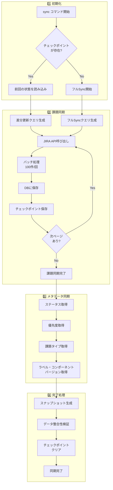
```mermaid
flowchart TB
    subgraph 初期化["1️⃣ 初期化"]
        A[sync コマンド開始] --> B{チェックポイント<br/>が存在?}
        B -->|Yes| C[前回の状態を読み込み]
        B -->|No| D[フルSync開始]
    end

    subgraph 課題同期["2️⃣ 課題同期"]
        C --> E[差分更新クエリ生成]
        D --> F[フルSyncクエリ生成]
        E --> G[JIRA API呼び出し]
        F --> G
        G --> H[バッチ処理<br/>100件/回]
        H --> I[DBに保存]
        I --> J[チェックポイント保存]
        J --> K{次ページ<br/>あり?}
        K -->|Yes| G
        K -->|No| L[課題同期完了]
    end

    subgraph メタデータ["3️⃣ メタデータ同期"]
        L --> M[ステータス取得]
        M --> N[優先度取得]
        N --> O[課題タイプ取得]
        O --> P[ラベル・コンポーネント<br/>バージョン取得]
    end

    subgraph 完了["4️⃣ 完了処理"]
        P --> Q[スナップショット生成]
        Q --> R[データ整合性検証]
        R --> S[チェックポイント<br/>クリア]
        S --> T[同期完了]
    end
```

---

## 差分更新の仕組み

差分更新は、JQL（JIRA Query Language）の `updated` フィールドを使用して実現されます。

### JQLクエリの構成

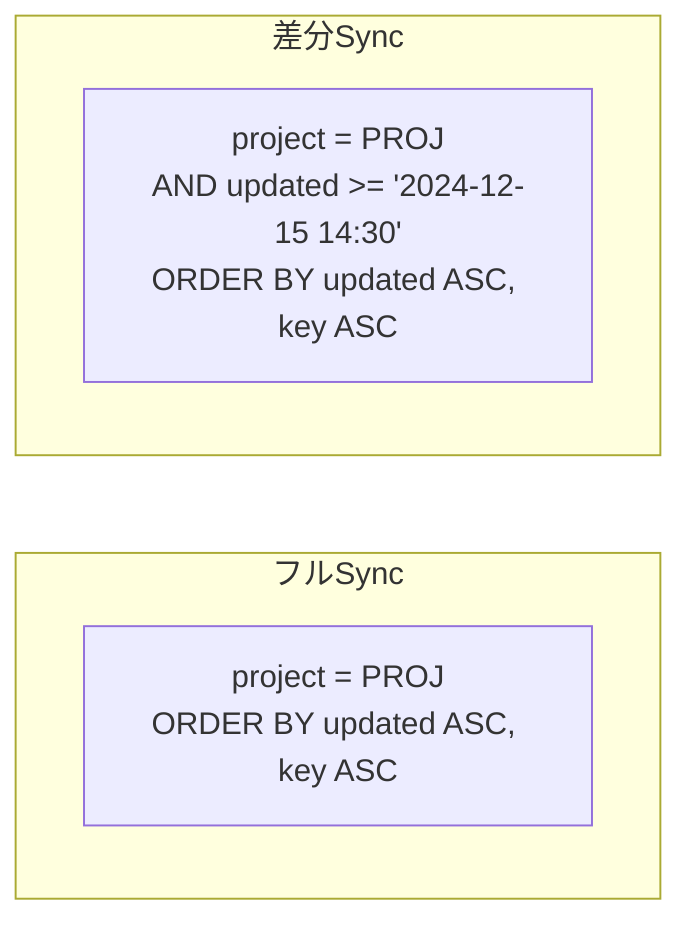
```mermaid
flowchart LR
    subgraph フルSync
        A["project = PROJ<br/>ORDER BY updated ASC, key ASC"]
    end

    subgraph 差分Sync
        B["project = PROJ<br/>AND updated >= '2024-12-15 14:30'<br/>ORDER BY updated ASC, key ASC"]
    end
```

### 詳細フロー

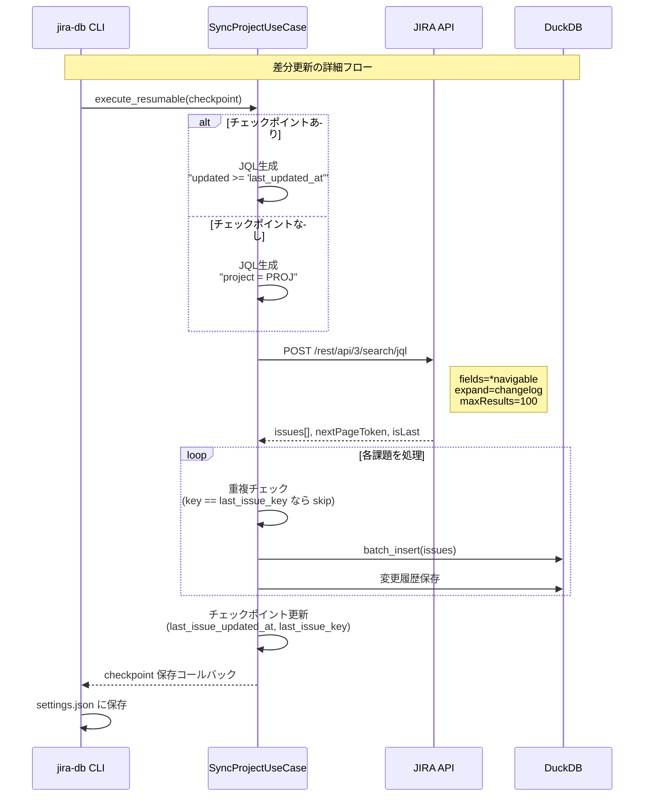
```mermaid
sequenceDiagram
    participant CLI as jira-db CLI
    participant UC as SyncProjectUseCase
    participant API as JIRA API
    participant DB as DuckDB

    Note over CLI,DB: 差分更新の詳細フロー

    CLI->>UC: execute_resumable(checkpoint)

    alt チェックポイントあり
        UC->>UC: JQL生成<br/>"updated >= 'last_updated_at'"
    else チェックポイントなし
        UC->>UC: JQL生成<br/>"project = PROJ"
    end

    UC->>API: POST /rest/api/3/search/jql
    Note right of API: fields=*navigable<br/>expand=changelog<br/>maxResults=100

    API-->>UC: issues[], nextPageToken, isLast

    loop 各課題を処理
        UC->>UC: 重複チェック<br/>(key == last_issue_key なら skip)
        UC->>DB: batch_insert(issues)
        UC->>DB: 変更履歴保存
    end

    UC->>UC: チェックポイント更新<br/>(last_issue_updated_at, last_issue_key)
    UC-->>CLI: checkpoint 保存コールバック
    CLI->>CLI: settings.json に保存
```

### なぜ `updated ASC` で並べ替えるのか

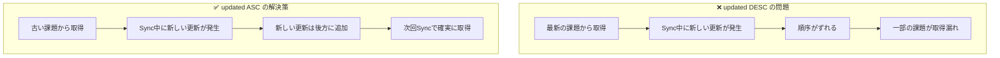
```mermaid
flowchart TB
    subgraph 問題["❌ updated DESC の問題"]
        A1[最新の課題から取得] --> A2[Sync中に新しい更新が発生]
        A2 --> A3[順序がずれる]
        A3 --> A4[一部の課題が取得漏れ]
    end

    subgraph 解決["✅ updated ASC の解決策"]
        B1[古い課題から取得] --> B2[Sync中に新しい更新が発生]
        B2 --> B3[新しい更新は後方に追加]
        B3 --> B4[次回Syncで確実に取得]
    end
```

**ポイント**:
- `updated ASC` により、古い更新から順に処理
- 同期中に発生した新しい更新は、次回の同期で確実に取得される
- 決定論的な順序により、再開時の一貫性を保証

---

## チェックポイント機構

### チェックポイントの構造

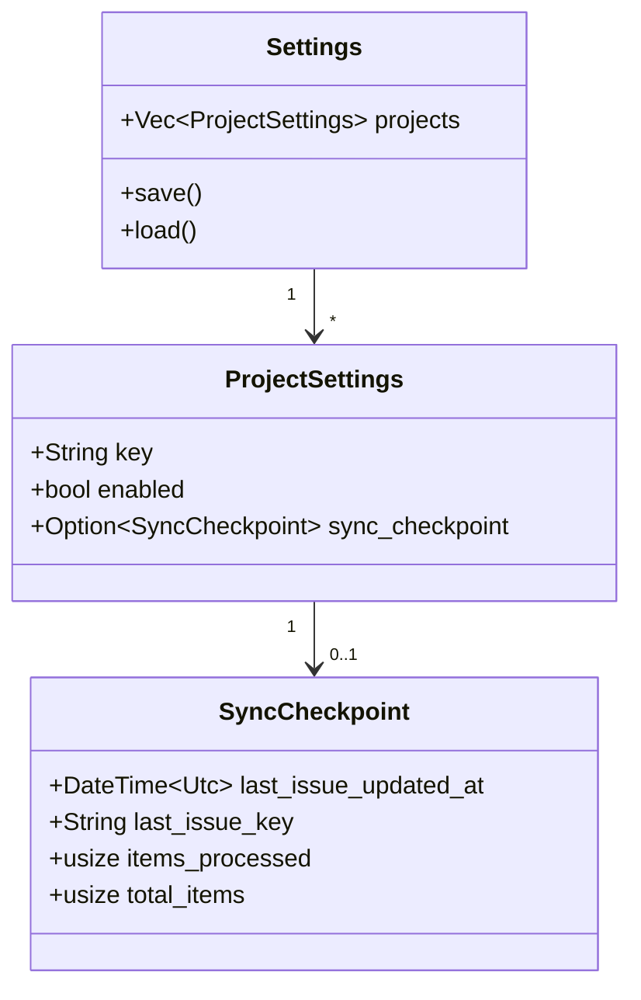
```mermaid
classDiagram
    class SyncCheckpoint {
        +DateTime~Utc~ last_issue_updated_at
        +String last_issue_key
        +usize items_processed
        +usize total_items
    }

    class ProjectSettings {
        +String key
        +bool enabled
        +Option~SyncCheckpoint~ sync_checkpoint
    }

    class Settings {
        +Vec~ProjectSettings~ projects
        +save()
        +load()
    }

    Settings "1" --> "*" ProjectSettings
    ProjectSettings "1" --> "0..1" SyncCheckpoint
```

### チェックポイントの保存タイミング

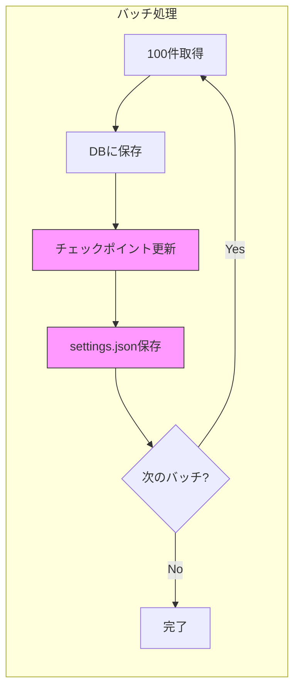
```mermaid
flowchart LR
    subgraph バッチ処理
        A[100件取得] --> B[DBに保存]
        B --> C[チェックポイント更新]
        C --> D[settings.json保存]
        D --> E{次のバッチ?}
        E -->|Yes| A
        E -->|No| F[完了]
    end

    style C fill:#f9f,stroke:#333
    style D fill:#f9f,stroke:#333
```

### settings.json の例

```json
{
  "projects": [
    {
      "key": "PROJ",
      "enabled": true,
      "sync_checkpoint": {
        "last_issue_updated_at": "2024-12-15T14:30:00Z",
        "last_issue_key": "PROJ-1234",
        "items_processed": 500,
        "total_items": 1500
      }
    }
  ]
}
```

---

## バッチ処理フロー

### 1バッチの詳細処理

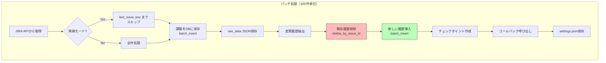
```mermaid
flowchart TB
    subgraph batch["バッチ処理（100件単位）"]
        A[JIRA APIから取得] --> B{再開モード?}

        B -->|Yes| C[last_issue_key まで<br/>スキップ]
        B -->|No| D[全件処理]

        C --> E[課題をDBに保存<br/>batch_insert]
        D --> E

        E --> F[raw_data JSON保存]
        F --> G[変更履歴抽出]

        G --> H[既存履歴削除<br/>delete_by_issue_id]
        H --> I[新しい履歴挿入<br/>batch_insert]

        I --> J[チェックポイント作成]
        J --> K[コールバック呼び出し]
        K --> L[settings.json保存]
    end

    style H fill:#fbb,stroke:#333
    style I fill:#bfb,stroke:#333
```

### なぜ変更履歴を削除→再挿入するのか

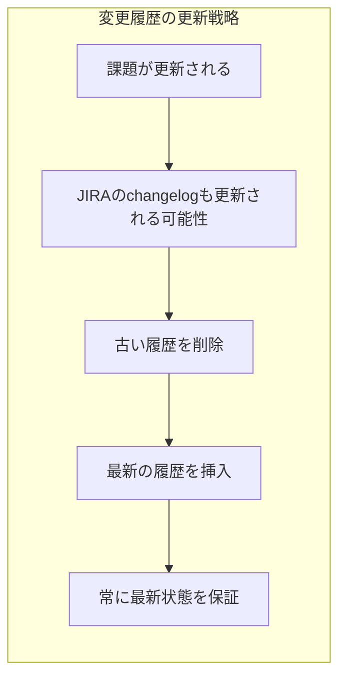
```mermaid
flowchart LR
    subgraph 理由["変更履歴の更新戦略"]
        A[課題が更新される] --> B[JIRAのchangelogも更新される可能性]
        B --> C[古い履歴を削除]
        C --> D[最新の履歴を挿入]
        D --> E[常に最新状態を保証]
    end
```

---

## 中断からの復旧

### 中断シナリオ

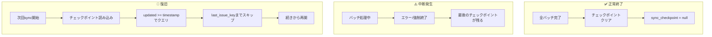
```mermaid
flowchart TB
    subgraph 正常終了["✅ 正常終了"]
        A1[全バッチ完了] --> A2[チェックポイント<br/>クリア]
        A2 --> A3[sync_checkpoint = null]
    end

    subgraph 中断["⚠️ 中断発生"]
        B1[バッチ処理中] --> B2[エラー/強制終了]
        B2 --> B3[最後のチェックポイント<br/>が残る]
    end

    subgraph 復旧["🔄 復旧"]
        C1[次回sync開始] --> C2[チェックポイント読み込み]
        C2 --> C3[updated >= timestamp<br/>でクエリ]
        C3 --> C4[last_issue_keyまでスキップ]
        C4 --> C5[続きから再開]
    end
```

### 再開時の重複回避

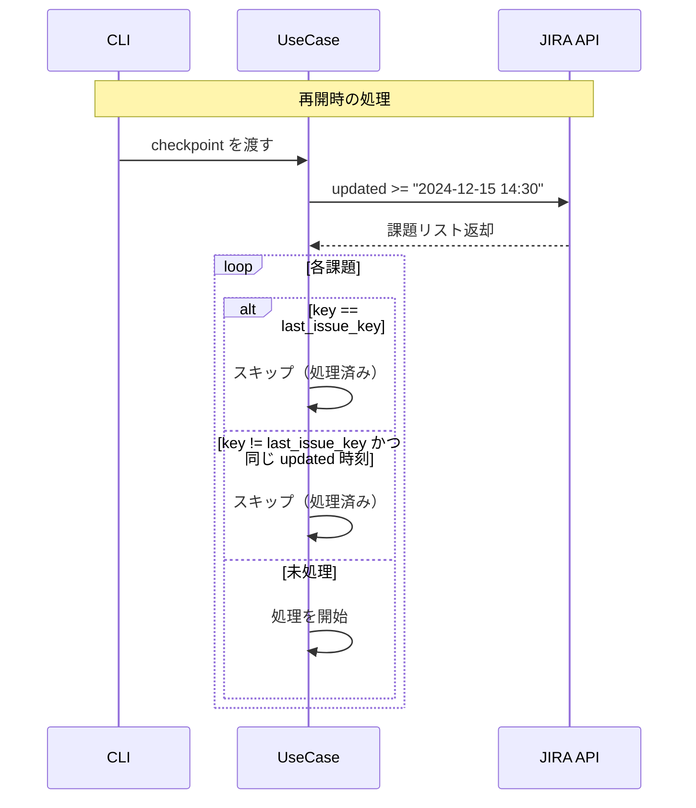
```mermaid
sequenceDiagram
    participant CLI as CLI
    participant UC as UseCase
    participant API as JIRA API

    Note over CLI,API: 再開時の処理

    CLI->>UC: checkpoint を渡す
    UC->>API: updated >= "2024-12-15 14:30"
    API-->>UC: 課題リスト返却

    loop 各課題
        alt key == last_issue_key
            UC->>UC: スキップ（処理済み）
        else key != last_issue_key かつ<br/>同じ updated 時刻
            UC->>UC: スキップ（処理済み）
        else 未処理
            UC->>UC: 処理を開始
        end
    end
```

**重複回避の仕組み**:
1. `updated >= timestamp` で候補を取得
2. `last_issue_key` と一致する課題までスキップ
3. 同じ `updated` 時刻の課題も `key` で判定してスキップ
4. 未処理の課題から処理を再開

---

## データ整合性の検証

### 同期完了時の検証

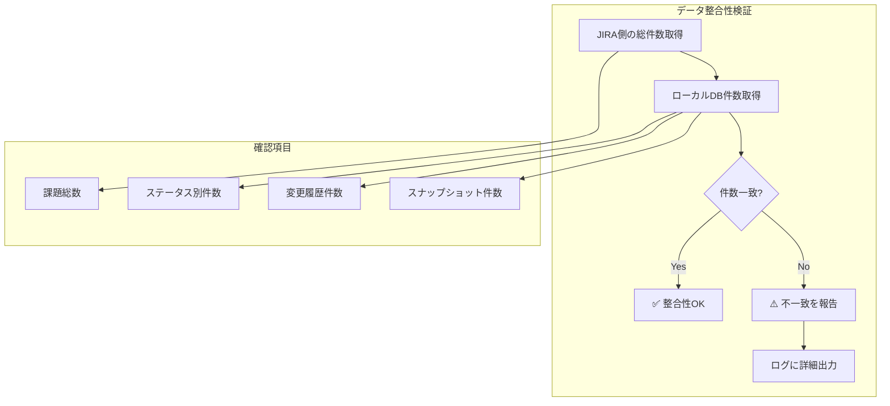
```mermaid
flowchart TB
    subgraph 検証["データ整合性検証"]
        A[JIRA側の総件数取得] --> B[ローカルDB件数取得]
        B --> C{件数一致?}

        C -->|Yes| D[✅ 整合性OK]
        C -->|No| E[⚠️ 不一致を報告]

        E --> F[ログに詳細出力]
    end

    subgraph 確認項目["確認項目"]
        G[課題総数]
        H[ステータス別件数]
        I[変更履歴件数]
        J[スナップショット件数]
    end

    A --> G
    B --> H
    B --> I
    B --> J
```

---

## 関連ファイル

| コンポーネント | ファイルパス |
|--------------|------------|
| SyncProjectUseCase | `crates/jira-db-core/src/application/use_cases/sync_project.rs` |
| SyncCheckpoint | `crates/jira-db-core/src/infrastructure/config/settings.rs` |
| JIRA API クライアント | `crates/jira-db-core/src/infrastructure/external/jira/client.rs` |
| CLI ハンドラ | `crates/jira-db-cli/src/main.rs` |

---

## 図の編集

このドキュメント内の Mermaid 図は GitHub 上で直接表示されます。

より詳細な編集が必要な場合は、[draw.io 版](./diagrams/sync-flow.drawio) を参照してください。
